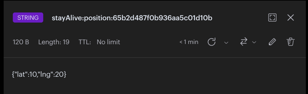
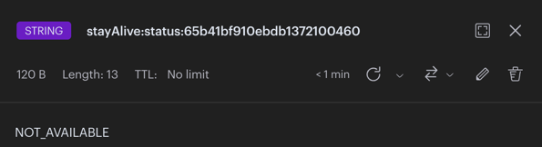

# Algorithme d'attribution d'urgence


## Description
L'algorithme d'attribution d'urgence a pour but de trouver un utilisateur de type ***urgentiste*** à proximité (5 min a pied) du lieu defini dans l'urgence.
Cet utilisateur sera selectioné et aura le choix d'accepter ou non d'aller à la position de l'urgence afin d'aider la personne en danger.


## Fonctionnement

### Position des sauveteurs

Chaque sauveteur transmet sa position afin que l'algorithme puisse l'utiliser.


**PATH**
````
POST /rescuer/position                            
````

**OBJECT**
```
latitude: 90
longitude: 90
```

Ces positions sont stockés en cache sur le serveur REDIS




### Disponibilité des sauveteurs

Chaque sauveteur transmet sa disponibilité afin que l'algorithme puisse l'utiliser.
La disponibilité indique si le sauveteur est disponible ou non a recevoir une mission d'urgence.


**PATH**
````
POST /rescuer/status                        
````

**OBJECT**
```ts
status: AVAILABLE
```

Ces disponibilités sont stockés en cache sur le serveur REDIS




### Reception de l'urgence

### Recuperation du sauveteur le plus proche

 Avec l'ensemble des postions des sauveteurs et les disponibilité sur le cache REDIS, nous pouvons trouver le sauveteur le plus proche.

Lorsque l'urgence est recuperé, cette operation commence.

#### Recuperation des rescuers
 Une fonction appelé **getAllPositions** renvoi un tableau contenant les sauveteurs de type **RescuerPositionWithId[]**

```ts
interface RescuerPositionWithId {
  id: Types.ObjectId;
  position: RescuerPosition;
}
```

#### Recuperation de la position la plus proche de l'urgence

une fonction appelé **getNearestPositionGoogle** renvoi la postion la plus proche de l'urgence de type **RescuerPositionWithId**

```ts
interface RescuerPositionWithId {
  id: Types.ObjectId;
  position: RescuerPosition;
}
```
<br></br>
*Input and Output Schema*
```
RescuerPositionWithId[] -> getNearestPositionGoogle() -> RescuerPositionWithId
```  


### Service Google

### Cooldown
